# Revita: Hệ thống Quản lý Khám bệnh Thông minh

## I. Giới thiệu

Quy trình quản lý khám bệnh tại các phòng khám đa khoa ở Việt Nam bao gồm nhiều giai đoạn tuần tự: lấy số thứ tự, hoàn tất thủ tục hành chính để đăng ký và khám bệnh, chỉ định các dịch vụ chẩn đoán và thủ thuật cần thiết, thanh toán chi phí, và cuối cùng là bác sĩ chẩn đoán tình trạng bệnh, kê đơn thuốc cho bệnh nhân. Quy trình này đòi hỏi sự phối hợp chặt chẽ giữa nhiều bên liên quan, bao gồm nhân viên hành chính, bác sĩ, bệnh nhân và thu ngân. Với dân số già hóa nhanh chóng và nhu cầu y tế ngày càng gia tăng, việc duy trì hiệu quả và công bằng trong quản lý trở nên cực kỳ thách thức, đặc biệt khi các bước thủ công dẫn đến ùn tắc và sai sót.

Để giải quyết các vấn đề này, chúng tôi đã phát triển và triển khai **Revita: Hệ thống Quản lý Khám bệnh Thông minh Tích hợp Gợi ý Chẩn đoán và Chatbot dành cho Phòng khám Đa khoa** -- một giải pháp công nghệ hiện đại nhằm tối ưu hóa và tự động hóa toàn bộ các giai đoạn trong quy trình khám bệnh. Hệ thống không chỉ giảm tải công việc hành chính mà còn nâng cao trải nghiệm tổng thể cho cả bệnh nhân và bác sĩ trong suốt hành trình chăm sóc sức khỏe.

Revita được xây dựng trên các nền tảng web, di động và máy tính để bàn, sử dụng các công nghệ tiên tiến như Next.js, Nest.js, React Native và Electron. Điều này đảm bảo tính linh hoạt và khả năng truy cập, cho phép người dùng tương tác mượt mà mọi lúc, mọi nơi -- từ đặt lịch khám trực tuyến đến hiển thị số thứ tự theo thời gian thực trên màn hình kiosk. Mục tiêu chính là nâng cao hiệu quả quản lý, cung cấp công cụ hỗ trợ tự động và tạo ra môi trường hiện đại, thân thiện với bệnh nhân cũng như nhân viên y tế.

Một tính năng nổi bật là hệ thống gợi ý chẩn đoán dựa trên ghi chú y khoa, công cụ thông minh được thiết kế chuyên biệt để hỗ trợ bác sĩ phân tích triệu chứng và đề xuất các tình trạng bệnh phù hợp. Hệ thống sử dụng xử lý ngôn ngữ tự nhiên (NLP) để trích xuất thông tin chính từ văn bản lâm sàng, kết hợp với thuật toán gợi ý dựa trên nội dung nhằm đưa ra các đề xuất chính xác và nhanh chóng -- từ đó nâng cao độ tin cậy trong chẩn đoán.

## II. Kiến trúc phần mềm

Hệ thống Revita được thiết kế dựa trên kiến trúc phân tầng (layered architecture), một mô hình kiến trúc phần mềm phổ biến giúp tổ chức hệ thống thành các tầng độc lập với trách nhiệm rõ ràng. Kiến trúc này đảm bảo tính mô đun hóa, khả năng bảo trì và mở rộng, đồng thời tách biệt các mối quan tâm giữa giao diện người dùng, logic nghiệp vụ và dữ liệu.

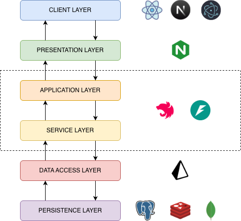

### Tầng giao diện người dùng (Client Layer)

Bao gồm ba ứng dụng độc lập về nền tảng nhưng thống nhất về trải nghiệm người dùng:
- Ứng dụng web được xây dựng trên Next.js với kiến trúc App Router hiện đại
- Ứng dụng di động được phát triển bằng React Native nhằm tối ưu hiệu năng trên cả hai hệ điều hành chính
- Ứng dụng desktop được đóng gói bằng Electron để đáp ứng nhu cầu xử lý tác vụ nặng tại các phòng khám

Các ứng dụng này chỉ chịu trách nhiệm hiển thị dữ liệu và thu thập tương tác người dùng, không chứa bất kỳ logic nghiệp vụ nào.

### Tầng trình diễn (Presentation Layer)

Được thực hiện bởi Nginx đóng vai trò cổng giao tiếp duy nhất với thế giới bên ngoài. Nginx đảm nhiệm các chức năng:
- Chấm dứt kết nối bảo mật
- Định tuyến yêu cầu theo kênh người dùng
- Cân bằng tải
- Giới hạn tần suất truy cập
- Chuyển tiếp giao thức WebSocket mà không làm gián đoạn luồng dữ liệu thời gian thực

Trong quá trình triển khai thì Nginx của hệ thống được Coolify tích hợp và quản lý tự động.

### Tầng ứng dụng (Application Layer)

Bao gồm các instance NestJS được tổ chức theo mô hình Backend-for-Frontend. Mỗi instance phục vụ riêng một kênh người dùng thông qua tập hợp các Controller chuyên biệt, thực hiện việc:
- Tiếp nhận yêu cầu
- Xác thực phiên làm việc
- Xác thực dữ liệu đầu vào
- Điều phối luồng xử lý xuống các tầng bên dưới

Việc tách biệt này cho phép tối ưu hóa cấu trúc phản hồi theo nhu cầu riêng của từng nền tảng mà không làm phức tạp hóa giao diện lập trình ứng dụng. Bên cạnh đó tầng này còn chứa hệ thống gợi ý chẩn đoán được xây dựng bằng FastAPI.

### Tầng dịch vụ (Service Layer)

Tập trung toàn bộ quy tắc nghiệp vụ cốt lõi của hệ thống quản lý bệnh viện. Các Service tại tầng này được triển khai dưới dạng các đơn vị xử lý thuần túy, không phụ thuộc vào cơ sở dữ liệu hay giao thức truyền tải. Tại đây diễn ra các quyết định nghiệp vụ quan trọng như:
- Kiểm tra ràng buộc lịch khám
- Tính toán độ ưu tiên khi phân phối bệnh nhân vào các quầy thủ tục, các phòng khám/buồng khám phù hợp
- Xử lý thanh toán đa phương thức (tiền mặt/chuyển khoản)
- Mã hóa/giải mã thông tin bệnh án khi lưu trữ/đọc ra

Đảm bảo tính nhất quán và khả năng kiểm thử độc lập.

### Tầng truy cập dữ liệu (Data Access Layer)

Được xây dựng trên Prisma Client kết hợp với Repository Pattern. Tầng này đóng vai trò trung gian duy nhất giữa logic nghiệp vụ và các hệ cơ sở dữ liệu, cung cấp giao diện thống nhất và an toàn kiểu dữ liệu cho mọi thao tác đọc ghi. Nhờ cơ chế sinh mã tự động, mọi thay đổi trong mô hình dữ liệu đều được phản ánh tức thì trên toàn hệ thống mà không yêu cầu chỉnh sửa thủ công.

### Tầng lưu trữ (Persistence Layer)

Sử dụng đồng thời ba hệ quản trị cơ sở dữ liệu phù hợp với đặc thù dữ liệu:
- **PostgreSQL**: Đảm bảo tính toàn vẹn và nhất quán cho các thực thể có quan hệ phức tạp phù hợp cho các hệ thống lưu trữ nhiều dữ liệu phức tạp và cần mối quan hệ chặt chẽ đặt biệt trong lĩnh vực y tế
- **MongoDB**: Phục vụ lưu trữ tài liệu phi cấu trúc ở đây là dữ liệu về thuốc được lấy về từ OpenFDA, vì lượng dữ liệu về dược này rất lớn, có cấu trúc đa dạng nên được lưu trữ trong MongoDB để giảm thời gian backup trên cơ sở dữ liệu chính cũng như tận dụng MongoDB để tối ưu hóa cơ chế tìm kiếm thuốc
- **Redis**: Được sử dụng làm bộ nhớ đệm và sử dụng Redis Stream (đóng vai trò như các message queue) để xử lý các yêu cầu đồng thời với độ trễ thấp, nhận và phát các sự kiện khi người dùng bốc số vào các quầy thủ tục/phòng khám

## III. Sơ đồ triển khai hệ thống

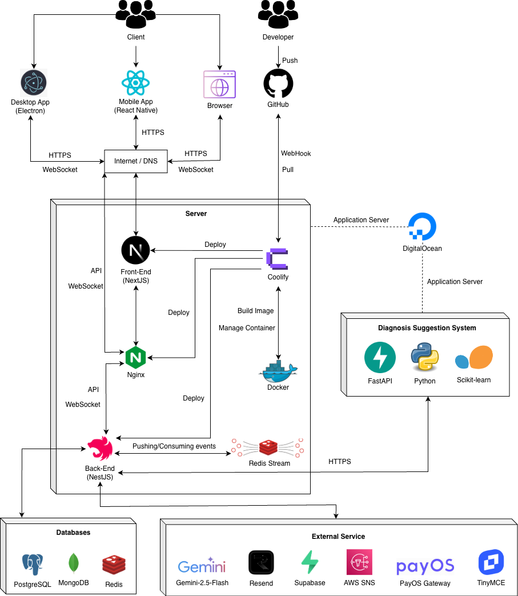

Hệ thống được triển khai theo mô hình CI/CD tự động với sự hỗ trợ của Coolify và Docker trên nền tảng DigitalOcean, bám sát các thực hành DevOps hiện đại. Khi lập trình viên đẩy (push) mã nguồn lên GitHub, Coolify nhận webhook và tự động pull phiên bản mới nhất, build Docker image, sau đó triển khai lên các application server. Nginx được tích hợp trực tiếp trong Coolify để quản lý định tuyến HTTPS và WebSocket, đảm bảo kết nối an toàn và real-time giữa client (Web, Mobile, Desktop) và server.

Cơ sở dữ liệu bao gồm PostgreSQL (dữ liệu cấu trúc), MongoDB (dữ liệu phi cấu trúc) và Redis (cache, session, stream) được triển khai trực tiếp trên server. Redis Stream đóng vai trò hàng đợi sự kiện (event queue), hỗ trợ xử lý bất đồng bộ các tác vụ như thông báo, cập nhật lịch hẹn, và đồng bộ dữ liệu real-time qua WebSocket.

Hệ thống tích hợp nhiều dịch vụ bên thứ ba:
- **Gemini-2.5-Flash** cung cấp gợi ý AI
- **Resend** gửi email thông báo
- **Supabase** lưu trữ ảnh, tài liệu
- **AWS SNS** gửi mã xác thực OTP qua SMS
- **PayOS** xử lý thanh toán trực tuyến
- **TinyMCE** hỗ trợ soạn thảo văn bản phong phú

Riêng hệ thống gợi ý chẩn đoán được huấn luyện bằng Python với thư viện Scikit-learn, triển khai dưới dạng microservice sử dụng FastAPI. Khi bác sĩ yêu cầu chẩn đoán, NestJS (Back-End) chuẩn hóa dữ liệu đầu vào, sau đó gọi HTTPS đến FastAPI để nhận danh sách các chẩn đoán gợi ý, đảm bảo tính chính xác và tốc độ phản hồi.

## IV. Công nghệ sử dụng trong hệ thống

- **NextJS** được sử dụng để xây dựng giao diện web quản trị và đặt lịch khám trực tuyến 24/7, tận dụng Server-Side Rendering (SSR) và Static Site Generation (SSG) nhằm tối ưu tốc độ tải trang, cải thiện SEO và đảm bảo trải nghiệm người dùng mượt mà trên mọi thiết bị.

- **NestJS** xây dựng hệ thống backend trung tâm của Revita, quản lý toàn bộ logic nghiệp vụ như lịch khám, hồ sơ bệnh nhân, ưu tiên theo quy định pháp luật và thanh toán chuyển khoản.

- **React Native** phát triển ứng dụng di động cho bệnh nhân và bác sĩ, cho phép đặt lịch, nhận thông báo, tra cứu hồ sơ trên cả iOS và Android từ một mã nguồn duy nhất.

- **Electron** xây dựng ứng dụng desktop cho các màn hình chờ và kiosk tự phục vụ, hiển thị số thứ tự theo thời gian thực.

- **Docker** chuẩn hóa môi trường triển khai dịch vụ, bảo đảm tính nhất quán giữa giai đoạn phát triển và vận hành.

- **FastAPI** triển khai microservices AI, xử lý gợi ý chẩn đoán từ ghi chú y khoa và chatbot hỗ trợ bệnh nhân.

- **Gemini 2.5 Flash** tích hợp làm lõi AI thông minh cho chatbot tư vấn 24/7 hỗ trợ bệnh nhân khi đến khám tại phòng khám.

- **PostgreSQL** được sử dụng làm cơ sở dữ liệu chính để quản lý toàn bộ hệ thống nghiệp vụ lớn của Revita.

- **Redis** được triển khai như bộ nhớ đệm (cache) hiệu năng cao và sử dụng Redis Streams để lưu trữ luồng sự kiện theo thời gian thực.

- **MongoDB** được dùng để lưu trữ và quản lý dữ liệu thuốc với khối lượng lớn, cấu trúc linh hoạt.

- **Supabase** cung cấp nền tảng backend-as-a-service cho lưu trữ các tập tin đa phương tiện trong hệ thống.

- **Nginx** được triển khai làm reverse proxy và SSL termination, định tuyến toàn bộ request từ bên ngoài đến Next.js, NestJS và FastAPI, đồng thời tự động cấp và gia hạn chứng chỉ Let's Encrypt.

- **Swagger** (OpenAPI) được tích hợp vào backend NestJS để tự động sinh tài liệu API tương tác, hỗ trợ kiểm thử endpoint trực tiếp trên trình duyệt và giúp frontend/mobile tích hợp nhanh chóng.

## V. Quy trình khám chữa bệnh tại phòng khám

**Bước 1**: Bệnh nhân có thể đặt lịch khám trước sau đó đến phòng khám, nhập thông tin khám bệnh nếu đăng ký khám lần đầu, nếu đã từng đến khám tại bệnh viện thì bệnh nhân nhập mã hồ sơ khám/ số điện thoại hồ sơ/mã đặt lịch (nếu có) sau đó hệ thống sẽ phân phối bệnh nhân vào các quầy làm thủ tục khám với cơ chế xoay vòng có ưu tiên.

**Bước 2**: Nhân viên quầy thủ tục nhấn gọi bệnh nhân đến quầy làm thủ tục, bệnh nhân quan sát thông tin của mình trên màn hình chờ để biết khi nào chuẩn bị đến làm thủ tục.

**Bước 3**: Bệnh nhân sau khi làm thủ tục khám thì cầm theo phiếu chỉ định các dịch vụ đến quầy thu ngân nộp để thanh toán các phí dịch vụ theo yêu cầu. Nhân viên thu nhân nhận phiếu chỉ định và bắt đầu tạo hóa đơn thanh toán với các dịch vụ bệnh nhân muốn thực hiện. Có hai phương thức thanh toán là bằng tiền mặt (nhân viên thu ngân xác nhận thanh toán thành công khi nhận tiền) và thanh toán qua hình thức chuyển khoản nhân viên tạo mã chuyển khoản tương ứng với hóa đơn và đưa mã chuyển khoản cho bệnh nhân, bệnh nhân thực hiện chuyển khoản (thông qua tài khoản ngân hàng hoặc tài khoản ví điện tử) khi chuyển khoản thành công thì hệ thống tự động cập nhật thông tin và xuất hóa đơn tự động.

**Bước 4**: Nếu bệnh nhân đặt lịch trước đó hoặc là yêu cầu chọn bác sĩ khi ở quầy thủ tục thì khi thanh toán thành công bệnh nhân sẽ được thêm vào hàng chờ của bác sĩ đó. Nếu không thì bệnh nhân sẽ đến trước khu vực khám và checkin tại các máy kiosk hoặc nhờ nhân viên ở tại quầy thủ tục (khu vực khám bệnh) để xác nhận vào khám, khi xác nhận xong thì hệ thống đưa bệnh nhân vào hàng chờ.

**Bước 5**: Bác sĩ nhấn gọi bệnh nhân vào phòng khám theo thứ tự hàng chờ, sau khi vào khám thì bác sĩ tiến hành chẩn đoán, tạo bệnh án, đơn thuốc cho bệnh nhân. Nếu bác sĩ mong muốn bệnh nhân thực hiện thêm các dịch vụ cho mục đích khám chữa bệnh thì bác sĩ sẽ tạo phiếu chỉ định cho bệnh nhân thực hiện các dịch vụ đó, sau đó quay về bước 3.

**Bước 6**: Khi đã hoàn thành các dịch vụ theo yêu cầu của bác sĩ thì bệnh nhân tiến hành quay lại khu vực khám để checkin chờ kết quả.

## VI. Một số chức năng chính

- Đề xuất/Xác nhận lịch làm việc.
- Đặt lịch hẹn khám bệnh
- Lấy số thứ tự để đến quầy thủ tục
- Cập nhật bệnh án, kết quả sau khi khám/thực hiện các dịch vụ.
- Quản lý phiếu chỉ định, bệnh án, đơn thuốc
- Hệ thống chatbot hỗ trợ bệnh nhân (Không hỗ trợ chẩn đoán, đơn thuốc, ... các yếu tố có thể ảnh hưởng đến sức khỏe của bệnh nhân.
- Hệ thống gợi ý các chẩn đoán dựa trên bệnh án của bệnh nhân (chỉ cho các bác sĩ trong hệ thống sử dụng)

## VII. Sơ đồ lớp

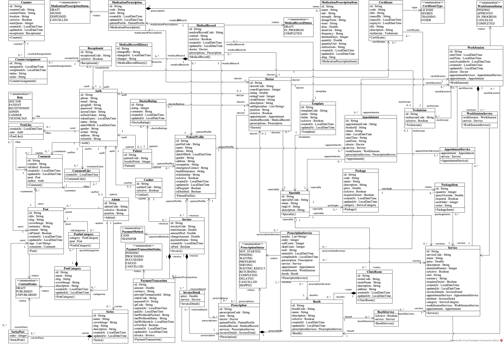

## VIII. Hiện thực

### Màn hình tiếp nhận bệnh nhân
Màn hình nhân viên quan sát thông tin bệnh nhân khi bệnh nhân lấy số đến quầy thủ tục.

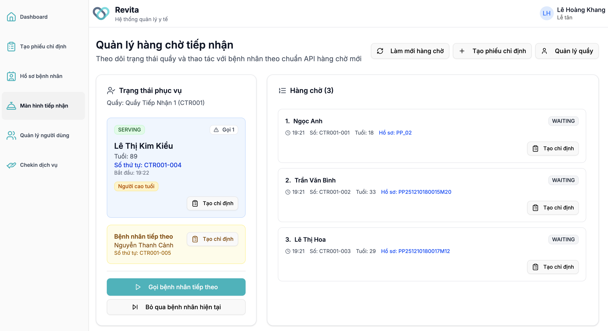

### Màn hình diễn đàn bài viết của phòng khám
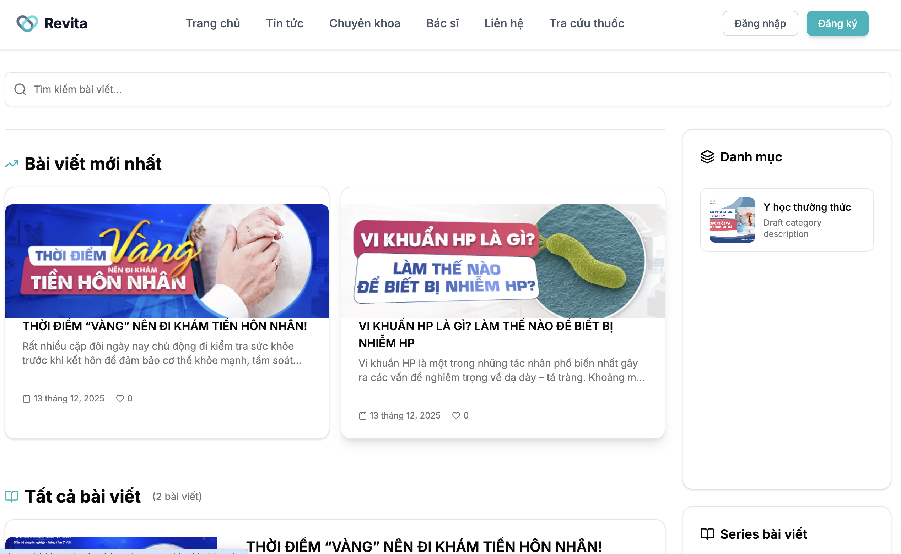

### Màn hình quản lý thông tin về cơ sở của phòng khám
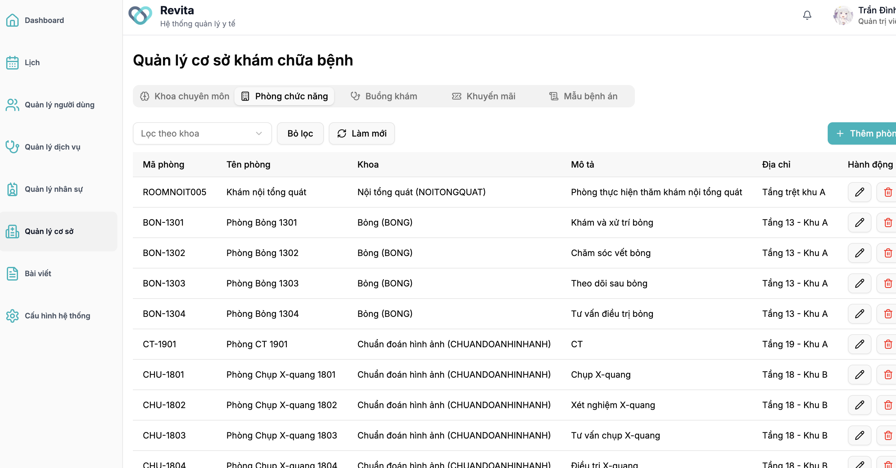

### Màn hình quản lý các dịch vụ tại phòng khám
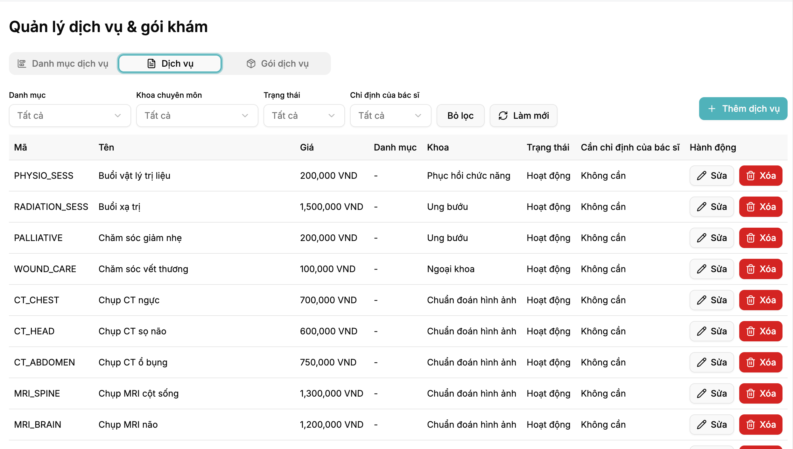

### Quản lý lịch khám chữa bệnh của bác sĩ
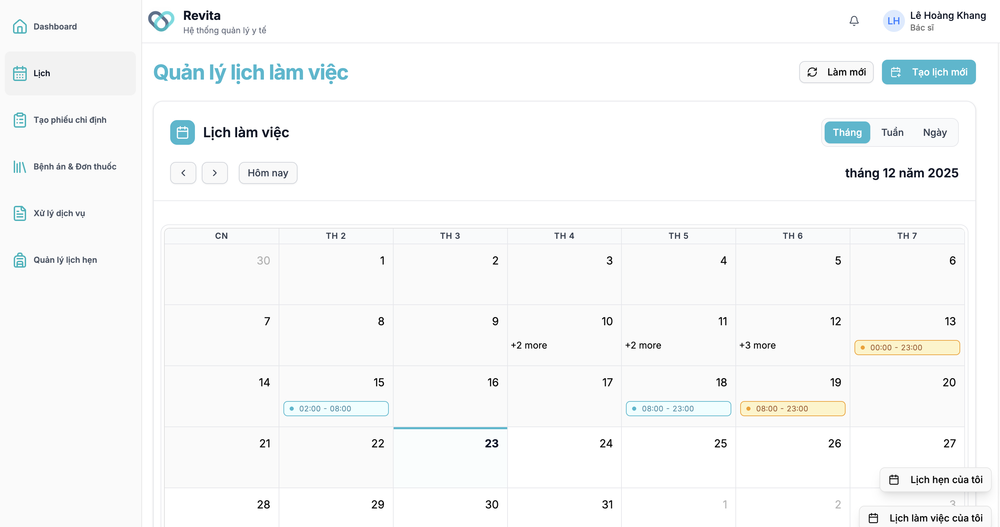

### Tạo phiếu chỉ định cho bệnh nhân
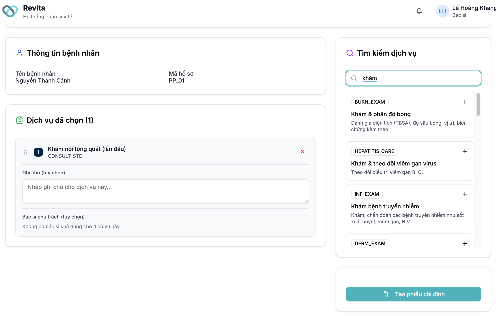

### Xem thông tin bệnh án
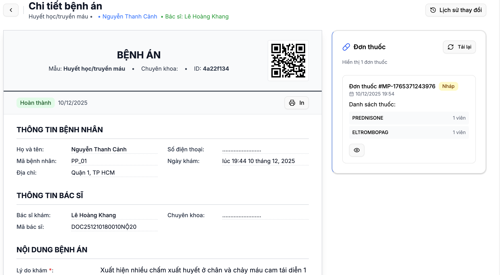

### Xem thông tin bệnh nhân
Thông tin hành chính, các bệnh án, lịch sử thực hiện khám/chữa bệnh tại phòng khám.

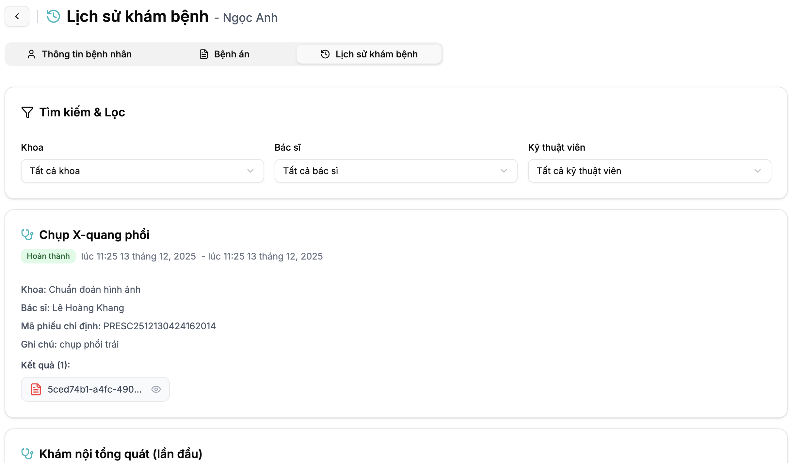

### Giao diện thanh toán dịch vụ
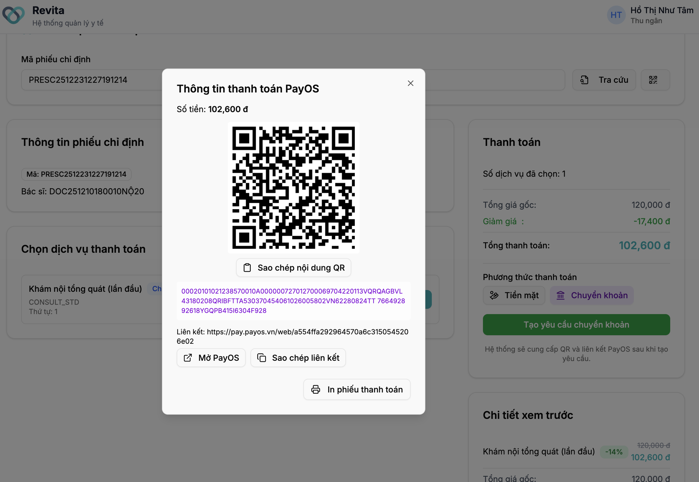
